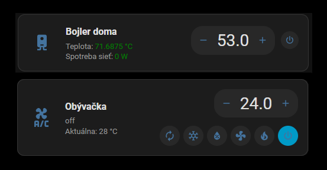

# DD Entity Card

A modern and highly configurable Home Assistant Lovelace card.

<p align="center">
  
</p>

## Features

- 🌡️ Entity state and attribute display
- 🎛️ Number controls with configurable step
- 🔌 Switch control
- ❄️ Climate HVAC mode selector
- 🌡️ Climate temperature control
- 📋 Multiple secondary rows
- 🔗 Multiple entities in a single card
- 🔢 Decimal value formatting
- 📏 Automatic unit display
- 🎨 Individual text styling
- 📱 Responsive mobile layout
- ⚡ Home Assistant actions
- 🔎 Open a different entity with `tap_action.entity`

---

## Installation

### HACS

The recommended way to install DD Entity Card is through HACS.

#### 1. Add the repository

Open:

**HACS → Frontend → Custom repositories**

Add:

```text
https://github.com/dewpza/dd-entity-card
```

Select **Dashboard**.

#### 2. Install

Search for **DD Entity Card** and click **Download**.

#### 3. Add the resource

HACS should add the resource automatically.

If you need to add it manually, use:

```text
/hacsfiles/dd-entity-card/dd-entity-card.js
```

Resource type:

**JavaScript Module**

---

## Quick Start

The simplest configuration is:

```yaml
type: custom:dd-entity-card
entity: sensor.temperature
```

---

## Climate Example

```yaml
type: custom:dd-entity-card

entity: climate.living_room

name:
  value: Obývačka

secondary:
  rows:
    - row:
        - text: "Aktuálna: "
        - attribute: current_temperature
          decimals: 1
          unit: true

value:
  decimals: 1
  unit: true

controls:
  - type: number
    step: 0.5

  - type: switch

  - type: select
```

This provides:

- target temperature adjustment
- power control
- HVAC mode selection
- current temperature display
- automatic temperature unit

---

## Boiler Example

DD Entity Card can use different entities for the target temperature, actual temperature and power control.

```yaml
type: custom:dd-entity-card

entity: input_number.nastavena_teplota_bojlera

name:
  value: Bojler doma

secondary:
  rows:
    - row:
        - text: "Teplota: "
          color: secondary

        - entity: sensor.teplota_bojler
          state: true
          decimals: 1
          unit: true
          color: green

controls:
  - type: number
    step: 0.5

  - type: switch
    entity: switch.boiler

tap_action:
  action: more-info
  entity: sensor.teplota_bojler
```

The card controls the target temperature, while the secondary row displays the actual boiler temperature.

Clicking the card opens the actual temperature sensor instead of the target temperature input.

---

## Secondary Rows

Secondary information can contain multiple rows and multiple items.

```yaml
secondary:
  rows:

    - row:
        - text: "Teplota: "
          color: secondary

        - entity: sensor.temperature
          state: true
          decimals: 1
          unit: true
          color: green

    - row:
        - text: "Výkon: "

        - entity: sensor.power
          state: true
          unit: true
```

Each item can be configured independently.

---

## Styling

Individual elements can be styled:

```yaml
name:
  value: Obývačka
  color: primary
  size: 18px
  weight: 700
```

Secondary items support the same styling:

```yaml
secondary:
  rows:
    - row:
        - text: "Teplota: "
          color: green
          weight: 700

        - entity: sensor.temperature
          state: true
          decimals: 1
          unit: true
          color: green
```

---

## Actions

The card supports Home Assistant actions.

For example:

```yaml
tap_action:
  action: more-info
```

You can open a different entity:

```yaml
tap_action:
  action: more-info
  entity: sensor.temperature
```

This is useful when the main entity is used for controlling something, but another entity should be displayed when the card is tapped.

---

## Documentation

Detailed documentation is available in the `docs/` directory:

- [Configuration](docs/configuration.md)
- [Controls](docs/controls.md)
- [Secondary Rows](docs/secondary.md)
- [Styling](docs/styling.md)
- [Actions](docs/actions.md)
- [Examples](docs/examples.md)

---

## Examples

Ready-to-use configurations are available in the [`examples/`](examples/) directory.

Examples include:

- Basic card
- Number control
- Switch
- Climate
- Boiler
- Secondary rows
- Multiple entities
- Styling
- Advanced configuration

---

## Requirements

- Home Assistant 2026.8 or newer
- HACS for recommended installation

---

## Support

If you find a bug or have a feature request, please open an issue on GitHub.

- [Report a bug](https://github.com/dewpza/dd-entity-card/issues)
- [Request a feature](https://github.com/dewpza/dd-entity-card/issues)

---

## License

DD Entity Card is released under the [MIT License](LICENSE).
